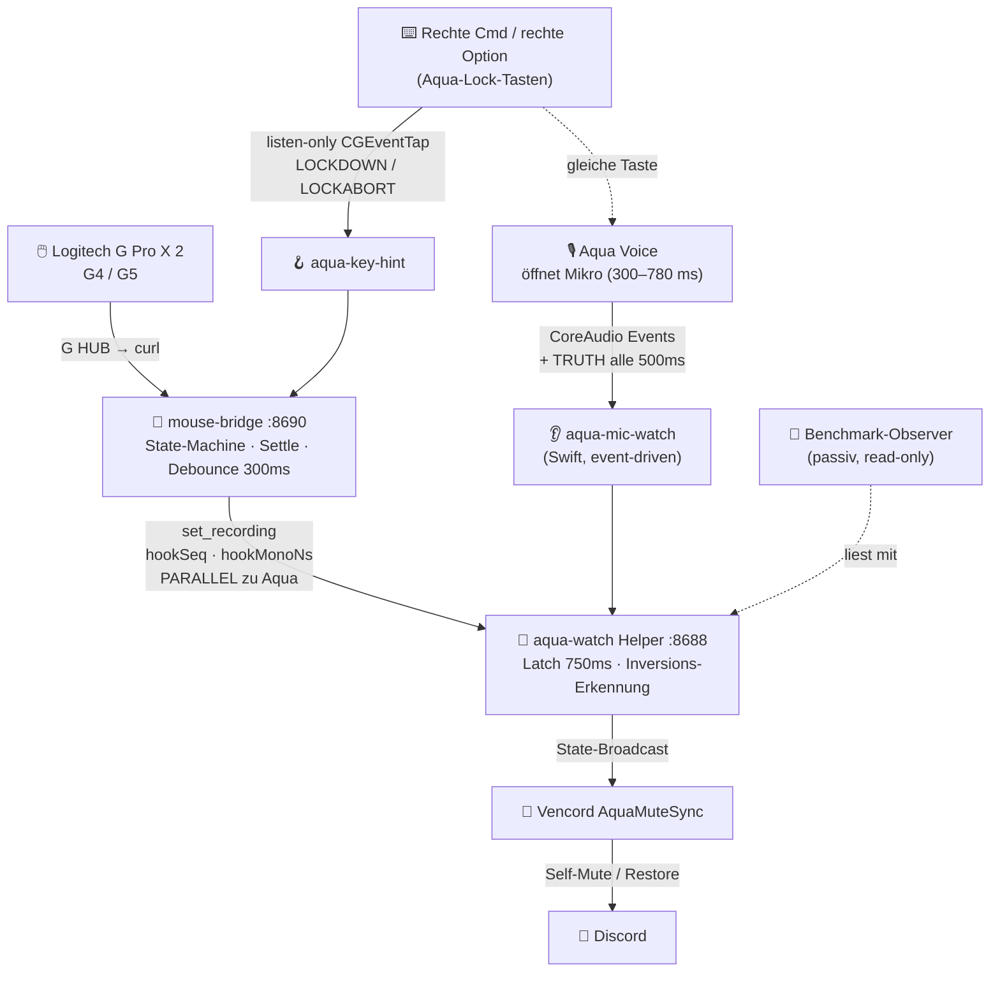
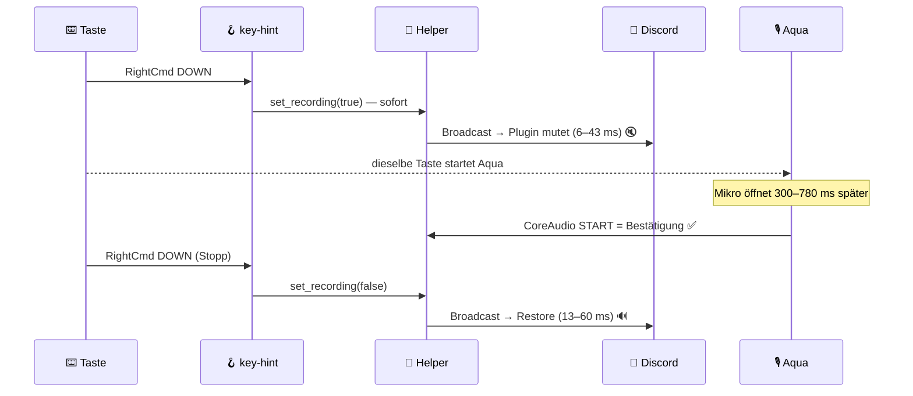

# 🎙️ aqua-logitech-discord

**Aqua Voice ⇄ Discord Mute-Sync in Millisekunden** — Tastatur-Hook, CoreAudio-Wahrheit, Vencord-Plugin und eine fail-closed Messpipeline in einem Repo.

   

> **Das Problem:** Aqua Voice braucht **300–780 ms**, nur um das Mikrofon zu öffnen (aus Aquas eigenem `mic_timings.json`, n=4122). Wer Discord erst danach mutet, ist immer zu spät.
> **Die Lösung:** Ein listen-only Tasten-Hook feuert das Mute-Signal **parallel** zu Aquas Mikrofon-Start — Discord ist stumm, bevor Aqua überhaupt aufnimmt.

---

## 📊 Gemessen, nicht geschätzt (live 2026-09-01, echte Tastendrücke)

| Strecke | Wert | Quelle |
|---|---|---|
| ⚡ Taste → Discord **gemutet** | **6–43 ms** | Observer-Frames, `.proof/keyhint-*` |
| 🔓 Stopp → Discord **wiederhergestellt** | **13–60 ms** | Observer-Frames |
| 🐌 Aquas eigener Weg (Taste → CoreAudio-Start) | **1,1–1,3 s** | CoreAudio-Echo-Korrelation |
| 🎤 Aquas Mikrofon-Öffnung allein | cold p50 **403 ms** / p95 **780 ms** | Aquas `mic_timings.json` |
| 💪 Härtetest: Zyklen im 100–200-ms-Takt | Kette hielt mit (16–61 ms) | `.proof/keyhint-v3-live-*` |

Alle Zeiten same-clock (mach monotonic), Warmups ausgeschlossen, jede Zahl aus committeten Beweisdateien.

---

## 🏗️ Architektur



## 🔄 Was bei einem Tastendruck passiert



---

## 🛡️ Schutzmechanismen (alle einzeln getestet)

| Mechanismus | Schützt vor | Wie |
|---|---|---|
| 🧯 **Kombi-Abort** | Cmd+C & Co. feuern Toggles | fire-on-DOWN + sofortiger Revert bei zweiter Taste/Modifier/Langdruck |
| 🚦 **Tap-Debounce 300 ms** | Salven kippen die Parität | schneller als Aqua togglen kann = geschluckt |
| 🔍 **Verdrehungserkennung** | hängende Inversionen | Mikrofon-**Wahrheit** alle 500 ms; stabile Abweichung (≥1 s, außerhalb 2,5 s Grace) wird zur Realität korrigiert — nie blind per Timer |
| 🔒 **Bridge-Latch 750 ms** | verspätete CoreAudio-Widersprüche | Kommando gewinnt kurzfristig, CoreAudio danach |
| ✋ **Manuelle Klicks gewinnen** | „forced mute loop" | echter Klick auf den Mute-Button beendet die Automatik für diesen Zyklus |
| 🚨 **Ausfall-Popup** | unsichtbar tote Kopplung | Discord-Notification bei Helper-offline/degraded, Klick = Sofort-Reconnect |
| 🧪 **Fail-closed Manifest** | geschönte Benchmarks | Run bleibt ROT ohne ≥25 valide Zyklen mit CoreAudio-Beweis + Restore |

---

## 🚀 Quickstart

```bash
# 1) Helper (LaunchAgent org.n281.aqua-watch → ws://127.0.0.1:8688)
./scripts/install-mute-helper.sh

# 2) Bridge + Tasten-Hook (LaunchAgent org.aqua.mouse-bridge → :8690)
./scripts/install-mouse-bridge.sh
cd packages/mouse-bridge/src && swiftc -O -framework CoreGraphics -framework Foundation -o ../bin/aqua-key-hint aqua-key-hint.swift

# 3) Vencord-Plugin deployen (braucht lokalen Vencord-Checkout) + Discord neu starten
./scripts/deploy-vencord-plugin.sh

# 4) Benchmark-Observer (passiv, optional)
./scripts/install-benchmark-observer.sh
```

**Gesundheitscheck:** `bash scripts/health-check.sh` · Bridge-Status: `curl -s 127.0.0.1:8690/status | jq .keyHint`

## 📏 Benchmark fahren

```bash
bash scripts/shortcut-run.sh 300     # 5-Minuten-Fenster, dann ≥25 Tastendruck-Paare
bash scripts/physical-run.sh 300     # Variante für die Logitech-G4-Route
```

Ausgabe: `.proof/…/run-result.json` mit **einem** `all_gates_valid`-Prädikat, p50/p95/p99 und jedem aussortierten Zyklus samt stabilem Grund (`route_mismatch`, `stale`, `baseline_premuted`, `synthetic_control`, …). 5 Warmups raus, ≥20 gemessene Zyklen Pflicht, Taste→CoreAudio-Physik ausgewiesen ausgeschlossen. Details: [`docs/PHYSICAL-RUN-RUNBOOK.md`](docs/PHYSICAL-RUN-RUNBOOK.md).

## ⌨️ Aqua-Tasten-Kontrakt

| Taste | Aqua-Aktion | Hook |
|---|---|---|
| `Fn` | activate (PTT) | – |
| `MetaRight` (rechte Cmd) | **lock** (Toggle) | ✅ feuert parallel |
| `AltRight` (rechte Option) | **lock** (Toggle) | ✅ feuert parallel |

Quelle ist immer die **live** `~/Library/Application Support/Aqua Voice/settings.json` — nicht der Export. Rechte Ctrl ist **kein** Aqua-Key.

## 🩺 Troubleshooting

| Symptom | Ursache | Fix |
|---|---|---|
| 🚨 Popup „NICHT verbunden" | Helper down | Klick aufs Popup (Sofort-Reconnect) oder `launchctl kickstart -k gui/501/org.n281.aqua-watch` |
| Plugin nach Discord-Update komplett weg | **Discord-Updates entfernen die Vencord-Injection** (`app.asar` wird ersetzt) | `app.asar` → `_app.asar`, Loader-Ordner `app.asar/` mit `index.js` → Vencord `patcher.js`; dann Discord-Neustart |
| ⚠️ „degraded" | CoreAudio-Watcher tot | Helper-Kickstart (Kommando oben) |
| Zustand wirkt verdreht | Salve schneller als Aqua | 3–5 s warten — Verdrehungserkennung übernimmt die Mikrofon-Wahrheit |
| Benchmark-JSONL fehlt | externe Log-Cleaner löschen `~/Library/Logs/aqua-*` | Fenster-Skripte kopieren Beweise sofort nach `.proof/` |

Legacy-Endpoints `/shortcut/left|right` bleiben deaktiviert ohne `AQUA_SHORTCUT_ENDPOINTS_ENABLED=1`. Der Observer ist strikt passiv (sendet nie `set_recording`/`app_state`); JSONL privat halten.

## 📐 Spec-driven

Jede Änderung läuft über OpenSpec (`openspec validate --strict`):
[`aqua-shortcut-route-latency`](openspec/changes/aqua-shortcut-route-latency/) (Tasten-Route, Verdrehungserkennung, Overrides) · [`aqua-physical-hook-e2e`](openspec/changes/aqua-physical-hook-e2e/) (Logitech-Route, Manifest-Pipeline) · ältere Changes unter [`openspec/changes/`](openspec/changes/).

## 🧩 Pakete

| Pfad | Rolle | Status |
|---|---|---|
| `packages/mouse-bridge` | State-Machine · Settle · hid-tap · **aqua-key-hint** | ✅ live, 6–43 ms Taste→Mute |
| `packages/mute-sync` | Swift-CoreAudio-Watcher · Helper-WS · **Vencord-Plugin** | ✅ live, 46 Plugin-Tests (esbuild+vm gegen echte Quelle) |
| `packages/benchmark` | Passiver Observer · frames-to-trials · fail-closed Manifest | ✅ Trockenkette beidseitig bewiesen |
| `packages/exporter` | Aqua-History-Export | eigenständig |
| `packages/stream-pip` | Stream-PiP-Plugin | unabhängig vom Mute |

Herkunft: [ATTRIBUTION.md](./ATTRIBUTION.md) · Verwandt: [aqua-mute-sync](https://github.com/Martin-Hausleitner/aqua-mute-sync) · [aqua-voice-exporter](https://github.com/Martin-Hausleitner/aqua-voice-exporter)

## 🧾 Ehrlicher Status

| Behauptung | Beweislage |
|---|---|
| Taste→Mute 6–43 ms, Restore 13–60 ms | ✅ live gemessen, Frames in `.proof/` |
| Salven-Härtetest (100-ms-Zyklen) | ✅ Kette hielt; Schutz (Debounce+Truth) danach deployed |
| Manuelle Klicks gewinnen / Popup / Override | ✅ 164 Tests grün, live deployed |
| **Formales 25-Paar-Manifest (`all_gates_valid`)** | ⏳ ausstehend — braucht normalen 2-s-Rhythmus (Aqua-Echo pro Zyklus Pflicht) |
| GUI-Schlussbeweis (Codex Computer Use) | ⏳ ausstehend |
