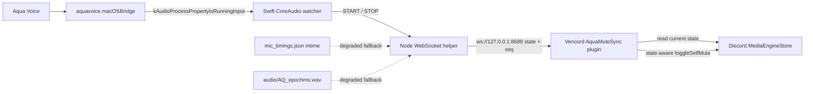

# Aqua Voice on macOS: recording detection and Discord mute synchronization

This report documents a local reverse-engineering project around Aqua Voice on macOS. The goal was to detect the exact recording window without opening the microphone device, then propagate that state to a Vencord plugin which could mute Discord while dictation is active.

The report deliberately separates observed facts from hypotheses and from unproven behavior. Aqua Voice and Discord are third-party products; this repository is not affiliated with either vendor.

## Status at publication

| Area | Status | Evidence |
|---|---|---|
| Aqua recording detection | **Proven** | Real `START`/`STOP` pairs from CoreAudio; capturer identified as `aquavoice.macOSBridge` |
| Sub-second detection | **Observed** | Events arrived promptly in repeated live recordings; the project did not build a lab-grade latency benchmark |
| Discord mute implementation | **Implemented** | Vencord plugin uses `MediaEngineStore` plus state-aware `toggleSelfMute` calls |
| Visual mute E2E | **Not proven** | The manager rejected a muted/restored screenshot pair because both files were bit-identical and showed the same normal microphone state |
| Runtime service | **Stopped** | The operator unloaded the LaunchAgent, renamed its plist to `.disabled`, and killed the watcher processes |

No screenshot pair in this repository should be interpreted as proof that the Discord mute E2E passed. Only the Aqua detection path has an accepted runtime proof.

## 1. What was actually detected

The first assumption was that the visible Electron application would own the microphone stream. Runtime enumeration showed otherwise:

- visible Aqua application bundle: `com.electron.aqua-voice`
- actual CoreAudio input client during dictation: **`aquavoice.macOSBridge`**

The distinction matters. Watching the Electron helper process misses the active input edge; watching the native bridge process exposes it directly.

The accepted detector uses CoreAudio process objects:

1. Read `kAudioHardwarePropertyProcessObjectList` from `kAudioObjectSystemObject`.
2. Read `kAudioProcessPropertyBundleID` for each returned process object.
3. Attach an `AudioObjectAddPropertyListenerBlock` for `kAudioProcessPropertyIsRunningInput` to matching Aqua objects.
4. Re-enumerate when the process-object list changes and remove listeners from objects which disappeared.
5. Compute the effective recording state as an OR across all matching Aqua objects.

Apple describes `isRunningInput` as true when a process is running audio I/O with at least one active input stream. This is exactly the signal needed here: it reports use of input by the target process without consuming the audio stream. See [Apple: `kAudioProcessPropertyIsRunningInput`](https://developer.apple.com/documentation/coreaudio/kaudioprocesspropertyisrunninginput), [Apple: `AudioHardwareProcess.isRunningInput`](https://developer.apple.com/documentation/coreaudio/audiohardwareprocess/isrunninginput), and [Apple: `AudioObjectAddPropertyListenerBlock`](https://developer.apple.com/documentation/coreaudio/audioobjectaddpropertylistenerblock(_:_:_:_:)).

The relevant implementation is [`helper/aqua-mic-watch.swift`](helper/aqua-mic-watch.swift). Its output contract is intentionally small:

```text
START
STOP
```

The accepted detection log contains four real `recording=true` / `recording=false` pairs and the runtime identity of the capturer:

```text
2026-07-14T20:07:20.443Z recording=true (coreaudio)
2026-07-14T20:07:25.781Z recording=false (coreaudio)
...
obj=234 pid=2309 input=1 bid=aquavoice.macOSBridge
```

The sanitized full excerpt is in [`.proof/2026-07-14_helper-detection-log.txt`](.proof/2026-07-14_helper-detection-log.txt).

### Do not open the input device

The watcher only reads CoreAudio object properties. It never opens the microphone device and never creates an audio capture session.

That constraint came from a real failure during exploration: an experimental probe opened the input device instead of merely observing process state. Aqua could then no longer acquire the device normally, so dictation was blocked until the probe was stopped and the device released. The experiment was discarded. The production watcher was designed around property reads and listeners specifically to avoid repeating that interference.

This is the main safety lesson from the reverse engineering: **observe the owning process, not the audio stream**.

## 2. Aqua file and IPC artifacts

Several artifacts under `~/Library/Application Support/Aqua Voice/` were useful for corroboration. Their contents are not published; only behavior and path shape are documented.

| Artifact | Observed behavior | Use in this project |
|---|---|---|
| `mic_timings.json` | mtime changes at recording start | Degraded-mode start signal |
| `audio/AQ_<epochms>.wav` | a new WAV appears when a recording stops | Degraded-mode stop signal |
| `bridge.sock` | Unix-domain socket used by Aqua internals | Documented only; protocol remains unknown and unsupported |
| `settings.json` | stores Aqua hotkey mappings | Read-only confirmation of trigger semantics |

The observed hotkey mappings were:

- `Fn` -> push-to-talk / activate
- `AltRight` -> lock recording
- `MetaRight` -> lock recording
- `Escape` -> cancel

`bridge.sock` was not used by the solution. It appears to connect the Electron layer to the native bridge, but there is no known public protocol contract. Depending on it would make the integration brittle and could alter Aqua state.

The Node helper uses the JSON mtime and WAV creation only when the native event channel is unavailable. It labels such state as `degraded=true`; CoreAudio remains the authoritative path.

## 3. Trigger behavior learned during testing

macOS System Events keystrokes did not reach Aqua as a functional Fn trigger. A synthetic Fn event posted at the HID event tap did:

```swift
let source = CGEventSource(stateID: .hidSystemState)
let down = CGEvent(keyboardEventSource: source, virtualKey: 63, keyDown: true)
down?.flags = .maskSecondaryFn
down?.post(tap: .cghidEventTap)

let up = CGEvent(keyboardEventSource: source, virtualKey: 63, keyDown: false)
up?.flags = []
up?.post(tap: .cghidEventTap)
```

This produced a real Aqua recording and was useful during controlled detection tests. It is not part of normal runtime operation. Do not run it in an active user session without explicit consent: it injects a global keyboard event and starts a real dictation.

The actual mute architecture does not depend on how Aqua was triggered. The CoreAudio state change is the trigger.

## 4. Architecture



### Swift watcher

[`helper/aqua-mic-watch.swift`](helper/aqua-mic-watch.swift) owns process discovery and CoreAudio listeners. It:

- matches Aqua process bundle IDs;
- logs each matched bundle once for auditability;
- tracks all matching objects and ORs their input state;
- removes listeners when objects disappear;
- emits only state edges.

### Node WebSocket bridge

[`helper/aqua-watch.mjs`](helper/aqua-watch.mjs) starts the Swift watcher and publishes state on `127.0.0.1:8688`:

```json
{
  "type": "state",
  "recording": true,
  "source": "coreaudio",
  "seq": 42,
  "degraded": false,
  "ts": 1784109877003
}
```

The monotonically increasing `seq` lets clients ignore stale messages. A client can send `{"type":"get_state"}` to request the latest state. The helper also includes a localhost single-instance check, graceful child shutdown, and degraded file polling.

### Vencord plugin

[`plugin/aquaMuteSync/index.tsx`](plugin/aquaMuteSync/index.tsx) connects from the Discord renderer to the localhost WebSocket. Its important invariants are:

- **Set, do not blindly toggle:** read `MediaEngineStore.isSelfMute()` and call `toggleSelfMute()` only when current and desired state differ.
- **Ownership:** persist whether this recording lifecycle owns the restore and store the pre-recording self-mute state.
- **Immediate restore:** restore the saved state as soon as `recording=false` arrives.
- **Verification:** measure the transition and check the restored state again after one second.
- **Drift protection:** query helper state periodically and re-mute if Discord becomes unmuted while Aqua is still recording.
- **Reconnect ordering:** reject older sequence values and resynchronize after reconnect.

The plugin uses Vencord's webpack-exposed stores and action modules. Vencord itself is GPL-3.0 and warns that Discord client modifications may violate Discord's Terms of Service; users should make that decision themselves. See the [official Vencord repository](https://github.com/Vendicated/Vencord).

## 5. The second mute source and why it was removed

Discord had a custom hotkey configured as:

- action: `Mikrofon ein-/ausschalten`
- key: `RIGHT ⌘`

The Aqua trigger also caused this binding to fire. That produced two writers for one Boolean state:

1. Discord's custom hotkey blindly toggled self-mute.
2. AquaMuteSync tried to set and later restore self-mute.

Depending on event order, two toggles could cancel each other or invert the final state. This cannot be made deterministic with timing guesses. The operator decision was to remove the Discord custom hotkey and make the CoreAudio hook the only automatic mute source.

Before removal:


After removal:


Both images are window-content crops of the Discord settings page. They contain no desktop, chat, server, email, or other private application content.

Rollback is manual: add a Discord custom hotkey for `Mikrofon ein-/ausschalten`, bind it to `RIGHT ⌘`, and enable it. Do not combine that rollback with automatic AquaMuteSync ownership unless the state machine is redesigned for multiple writers.

## 6. Tribunal review

Three independent Grok review passes returned **FAIL**. That result is preserved because the first implementation was not production-ready.

| Review lane | Main findings | Changes made |
|---|---|---|
| Architecture | in-memory restore ownership, stale/out-of-order WS state, helper startup gaps, reconnect and lifecycle races | persistent `ownMute` / `preMute`, monotonic sequence, lifecycle reset, reconnect resync, state-aware mute setter |
| UX | wrong/low-visibility surface, toast spam, weak disconnected state, stale recording indicator | toasts default off, drift toast once per recording, explicit disconnected icon, recording indicator requires a live helper, toolbox action retained |
| Operations | hard-coded LaunchAgent paths, listener leaks, port crash loop, missing shutdown, Vencord autopatcher could overwrite the custom build | generated plist with discovered Node/repo paths, modern bootstrap and health check, listener removal, EADDRINUSE probe, SIGTERM handling, deploy marker check and autopatcher warning |

Not every recommendation was implemented. In particular, the plugin still relies on a custom Vencord source build and can be removed by a later Vencord/Discord repatch. The UI remains a userplugin surface rather than a first-class native Discord integration. These are operational risks, not hidden successes.

## 7. Failed E2E proof and accepted evidence boundary

The attempted visual E2E proof was invalid. The proposed `recording-muted` and `restored-unmuted` PNG files were bit-identical: same MD5, same byte size, and the same normal microphone icon. Possible causes included a capture outside the mute interval, a wrong crop, or a plugin path that did not reach Discord in that run.

The correct response is not to reinterpret those images. They prove nothing, so they are excluded from this public repository.

What remains accepted:

- CoreAudio detection of real Aqua starts and stops;
- identity of `aquavoice.macOSBridge` as the input client;
- source-level implementation of the helper and plugin;
- privacy-safe before/after evidence for removal of the colliding Discord hotkey.

What remains unproven:

- a visually verified Discord muted icon during a real Aqua recording;
- a visually verified restored icon after that recording;
- long-run reliability across sleep/wake, Aqua upgrades, Discord upgrades, and Vencord repatching.

## 8. Current operational state

At the operator's request, the runtime was shut down:

- LaunchAgent `org.n281.aqua-watch` unloaded;
- its plist renamed with a `.disabled` suffix;
- watcher processes killed;
- no further Aqua or Discord UI automation permitted.

Publishing this repository does not restart any component. Installation scripts are source artifacts only and were not executed as part of publication.

## 9. Privacy gate used for publication

The public repository was assembled as a new, clean Git history rather than pushing the development repository and all of its experiments.

The gate excludes:

- full-desktop screenshots;
- rejected or ambiguous mute-state screenshots;
- raw Aqua settings, audio, timing histories, and IPC data;
- credentials, cookies, API secrets, relay addresses, and private server identifiers;
- machine-specific binaries and development logs.

Only the two inspected Discord settings crops and the sanitized detection log are included under `.proof/`.

## License and trademarks

Repository code and documentation are published under the MIT License. Aqua Voice, Discord, macOS, CoreAudio, and Vencord remain the property of their respective owners. No affiliation or endorsement is implied.

=== N297 === https://github.com/Martin-Hausleitner/aqua-mute-sync + ~/Code/vencord-aqua-mute/AQUA-REVERSE-ENGINEERING.md
